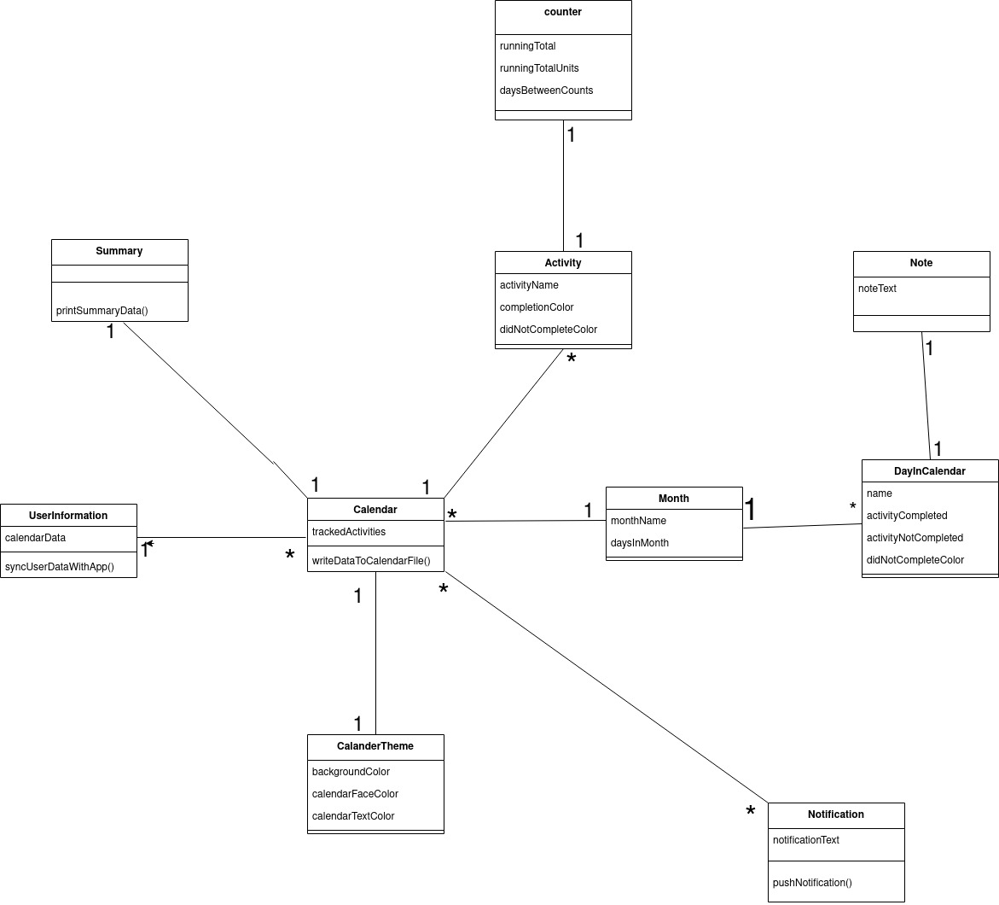

# Deliverable 3 - Analysis

### System Description
   Project Calandar Project is a free calendar app that helps users track habits and routines 
on a daily basis. Individuals can track their workout routines, eating habits, smoking habits, and 
other habits in a visual way which provides the individual with instant feedback. This gives the user 
gratification and motivation to continue keeping up with their habits. Our product is unique in that 
the user of the calandar app can extensively customize the colors of the app’s user interface and 
receive reminders about user habits. Project Calandar Project solves the problem of people committing 
to goals which affects goal oriented people. This results in people giving up on those goals. 
For goal oriented people who struggle to keep track of progress, App Calandar App is a calendar 
app that helps keep track of goals and habits using color coordination unlike Streaks, which does not 
display progress using colors or a calendar.

   Our system involves a user of our app and a web server. The webserver stores **user information** so 
that if the user were to download the app on another device all of their data would be synced from the 
server to the users app. The user is able to create any number of **<ins>calendars</ins>**, each having any number of 
activities/habits associated with them. Upon creating a calendar the user can designate what color is 
associated with completion of an activity or a lack of  completion of an acitivity. The user can select 
any day in the calendar and associate a rgb or preset color with that activity to signify whether 
an acitivity/habit was completed or not. The user can view the calendar as a whole and see what days have 
been marked a certain color and gain instant feedback on their progress of completing their goals. To keep 
the user focused on their goals, the system will send the user a notification, reminding them to mark 
the activities/habits that they have completed in the day. There will also be a user defined counter that can be assigned per activity.
The counter can be incremented everytime the user marks a day as completed in the calendar. This counter will be used to track a running total 
related to the users tracked activity. On each day, the user will be able to leave a note to add details about their activity 
that day. These calendars will be able to be navigated much like Google Calendar, where the calendar can be viewed from 
a weekly or monthly view. The data can also be accessed 
through a summary view, where progress is listed in a more compact form.

# 2. Model  
  
