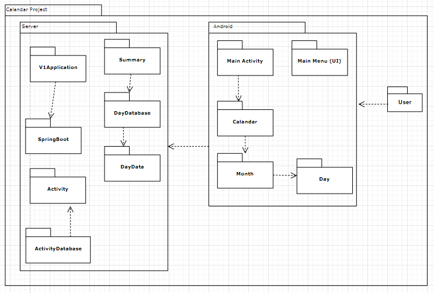

# D5 Design

### Description
- 1 to 2 paragraphs to describe system
    - can reuse and update text from previous deliverables

### Architecture

- The two main parts of our project are the android app (front end) and the server it communicates with (back end). Each of these have their own package containing many other packages representing the classes and APIs used by them. The arrows between packages indicate that one uses or has access to another. This also applies with larger scale interactions, meaning the user uses the front end and the front end has access to the back end. The front end contains UI related classes and the back end contains classes that store data to be accessed by the app, as well as SpringBoot, the API used to run the server.

### Class diagram
- Refine class diagram, include implementation details
    - visibilities
    - attributes
    - attribute types
    - return types
    - parameters
- Should match code

### Sequence diagram
- Diagram that represents how objects in the system interact for a specific use case
- Include use case description here
- Be consistent with class diagram and architecture

### Design patterns
- Design Pattern 1 (Creational): We use more of a factory method pattern to create a centralize creation of all objects of Calandar type  
and controlling that Calandar Object. The Calandar object is the complete data for the client side of our Calandar project for now.  
[Calandar Class](https://github.com/TJohnsonAZ/Calandar-Project/blob/main/Calandar%20App/app/src/main/java/com/example/calandarapp/Calandar.java)  
[MainActivity](https://github.com/TJohnsonAZ/Calandar-Project/blob/main/Calandar%20App/app/src/main/java/com/example/calandarapp/MainActivity.java)  
  

- Design Pattern 2 (Behavioral): We use a command pattern to encapsulate marking the day on the server and making sure the information is stored  
 on the server. This will only work when the user makes the day as completed or non-completed and the user is also trying to see what days they  
 have marked as completed already and not completed.  
[DayDataController](https://github.com/TJohnsonAZ/Calandar-Project/blob/main/Calandar%20App/app/src/main/java/com/example/calandarapp/Calandar.java)  
[MainActivity](https://github.com/TJohnsonAZ/Calandar-Project/blob/main/Calandar%20App/app/src/main/java/com/example/calandarapp/MainActivity.java)  
[DayData](https://github.com/TJohnsonAZ/Calandar-Project/blob/main/CalandarServerv1/v1/src/main/java/com/CalandarProject/v1/DayData.java)  
[DayDataDatabase](https://github.com/TJohnsonAZ/Calandar-Project/blob/main/CalandarServerv1/v1/src/main/java/com/CalandarProject/v1/DayDatabase.java)  
  

- Design Pattern 3 (Behavioral): We use Iterators are used to access the month to month and to switch from one month to another and display it to the  
user with proper starting day. This helps with making sure the proper month is displayed. We need to make sure that everything is connected,  
and this only works if the user is changing the month.  
[Calandar Class](https://github.com/TJohnsonAZ/Calandar-Project/blob/main/Calandar%20App/app/src/main/java/com/example/calandarapp/Calandar.java)  
[MainActivity](https://github.com/TJohnsonAZ/Calandar-Project/blob/main/Calandar%20App/app/src/main/java/com/example/calandarapp/MainActivity.java)  
[Month](https://github.com/TJohnsonAZ/Calandar-Project/blob/main/Calandar%20App/app/src/main/java/com/example/calandarapp/Month.java)  
  

### Design principles
- How does design observe SOLID principles
- description of followed principles giving concrete examples from classes

