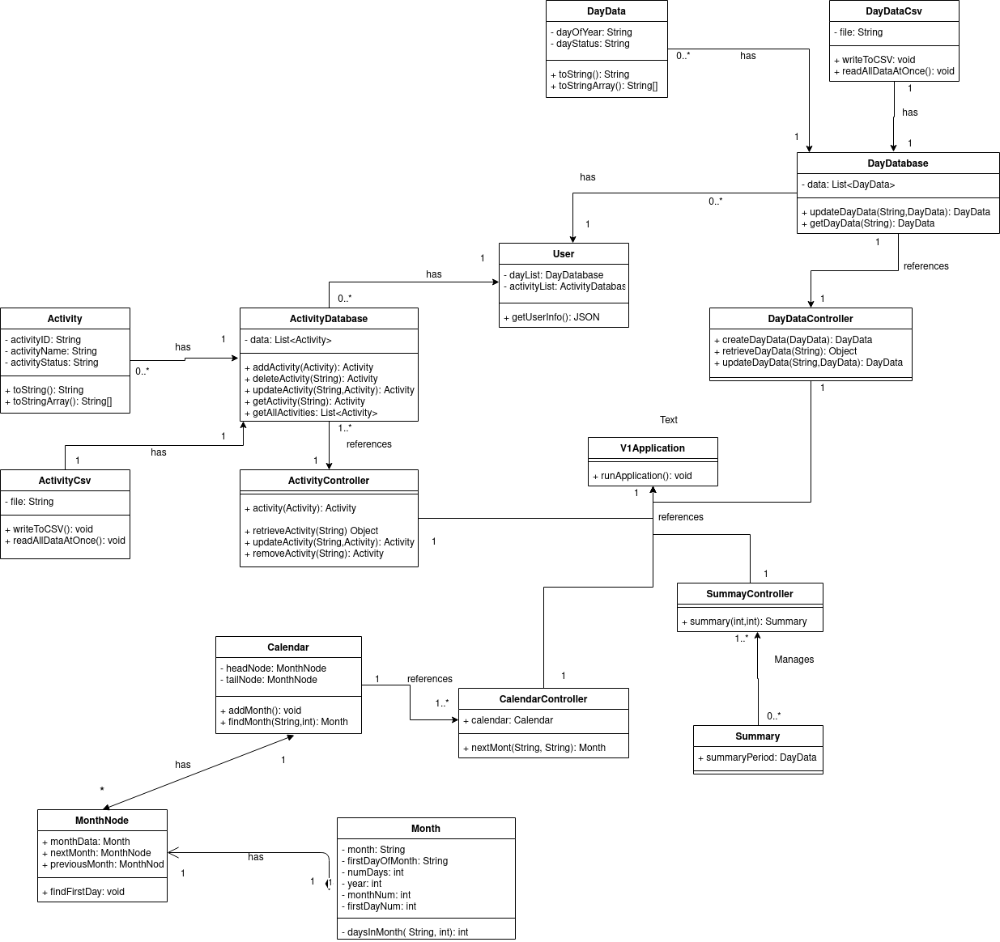

# D5 Design

### Description
- It is harder than ever to alter our habits to change things like biting our nails or reading more often. In an age of smartphones, technology, and endless distractions, App Calandar App is streamlined to minimize time spent on the app. It allows you to create calendars for tracking any type of habit. From there, you can set up reminders, modify the appearance of your calendar, connect with friends, and receive rewards for consistency.
The server stores user information which allows their data to synced from the server to the app regardless of device. The user is able to create any number of calendars in order to better organize their habits. Upon creating a calendar, a status color is chosen by the user to be associated with the activity being tracked. These colors are used to describe whether an activity was completed for a specific day in the calendar. There will be a broader view of the calendar in order to see what days have been marked and receive instant feedback on their progress. The system will send the user a notification reminding them to mark the activities that they have completed for the day. The user may create a counter that can be assigned to a specific activity. This counter will be used to track a running total of the tracked activity. The user will be able to leave a note to add details about their activity for each day.

### Architecture

- The two main parts of our project are the android app (front end) and the server it communicates with (back end). Each of these have their own package containing many other packages representing the classes and APIs used by them. The arrows between packages indicate that one uses or has access to another. This also applies with larger scale interactions, meaning the user uses the front end and the front end has access to the back end. The front end contains UI related classes and the back end contains classes that store data to be accessed by the app, as well as SpringBoot, the API used to run the server.

### Class diagram

### Sequence diagram

### Design patterns
- Design Pattern 1 (Creational): We use more of a factory method pattern to create a centralize creation of all objects of Calandar type  
and controlling that Calandar Object. The Calandar object is the complete data for the client side of our Calandar project for now.  
[Calandar Class](https://github.com/TJohnsonAZ/Calandar-Project/blob/main/Calandar%20App/app/src/main/java/com/example/calandarapp/Calandar.java)  
[MainActivity](https://github.com/TJohnsonAZ/Calandar-Project/blob/main/Calandar%20App/app/src/main/java/com/example/calandarapp/MainActivity.java)  
  

- Design Pattern 2 (Behavioral): We use a command pattern to encapsulate marking the day on the server and making sure the information is stored  
 on the server. This will only work when the user makes the day as completed or non-completed and the user is also trying to see what days they  
 have marked as completed already and not completed.  
[DayDataController](https://github.com/TJohnsonAZ/Calandar-Project/blob/main/Calandar%20App/app/src/main/java/com/example/calandarapp/Calandar.java)  
[MainActivity](https://github.com/TJohnsonAZ/Calandar-Project/blob/main/Calandar%20App/app/src/main/java/com/example/calandarapp/MainActivity.java)  
[DayData](https://github.com/TJohnsonAZ/Calandar-Project/blob/main/CalandarServerv1/v1/src/main/java/com/CalandarProject/v1/DayData.java)  
[DayDataDatabase](https://github.com/TJohnsonAZ/Calandar-Project/blob/main/CalandarServerv1/v1/src/main/java/com/CalandarProject/v1/DayDatabase.java)  
  

- Design Pattern 3 (Behavioral): We use Iterators are used to access the month to month and to switch from one month to another and display it to the  
user with proper starting day. This helps with making sure the proper month is displayed. We need to make sure that everything is connected,  
and this only works if the user is changing the month.  
[Calandar Class](https://github.com/TJohnsonAZ/Calandar-Project/blob/main/Calandar%20App/app/src/main/java/com/example/calandarapp/Calandar.java)  
[MainActivity](https://github.com/TJohnsonAZ/Calandar-Project/blob/main/Calandar%20App/app/src/main/java/com/example/calandarapp/MainActivity.java)  
[Month](https://github.com/TJohnsonAZ/Calandar-Project/blob/main/Calandar%20App/app/src/main/java/com/example/calandarapp/Month.java)  
  

### Design principles
- Single Class Responsibility
    - Classes in our project are created to serve one purpose. While there are many examples, the classes that store the data for the databases are a prime example of this. These classes only have methods that modify a list array that houses the data, and do nothing besides operating on this data.
- Open/Closed Principle
    - In our current deployment we have not integrated interfaces, but using an interface would allow us to adjust code properly. We had initially planned to incorporate interfaces into the system, but so far have not had time and they have been planned for a future update. This would increase functionality by allowing easy removal or addition of features to the software.
- Liskov Substitution Principle
    - The current deployment also does not have anything to cover the Liskov substitution principle, however this is planned for our CSV manager classes and could also be used for the database classes. The CSV managers are very similar code and doing the exact same process using different data. The plan is to create a generic class, and create typed subclasses to pass different data into the single generic type manager, writing our data to save files and reading those save files back into the databases.
- Interface Segregation Principle
    - Our interfaces within the current build are separated into the menu and a month of a calendar. Instead of loading multiple uses into the same interface, we have separated them for ease of use by the client. More need to be added, but this practice will be continued into future interface design.
- Dependency Inversion Principle
    - Our high level modules do not depend on low level modules to operate. For example our controllers that operate the HTTP requests do so through the Spring BOOT framework, and will continue to receive requests and respond accordingly even if some modules were removed.