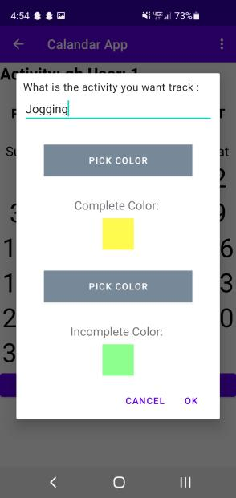
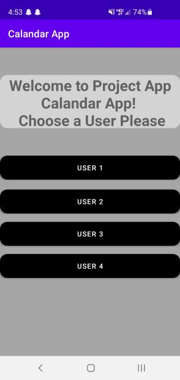

# D6 Implementation 2

### Introduction
- Describe system
- Contain value proposition and main features
- GitHub and Trello links (Up to date)
- 1 to 2 paragraphs plus links

### Implemented Requirements
- List requirements (user stories, issues or use cases) implemented in release
- For each requirement:
    - Trello link that describes requirement
    - Name of who implemented requirement AND link to pull request on GitHub
    - Name of who reviewed and approved the pull request
    - Screen shot/Print screen of implemented feature if applicable
    
1. [As a user, I want there to be separate colors for each of my activities on my calendar, so that I can tell them apart.](https://trello.com/c/5E1GUVXi/28-as-a-user-i-want-there-to-be-separate-colors-for-each-of-my-activities-on-my-calendar-so-that-i-can-tell-them-apart)  
   - Completed by Zach, Calvin
   - Reviewed by [Zach](https://github.com/TJohnsonAZ/Calandar-Project/pull/68)
   - 
   
2. [As a user, I should be able to have my own distinct calendar](https://trello.com/c/PZ7KmiQn/26-as-a-user-i-should-be-able-to-have-my-own-distinct-calendar)  
   - Completed by Kadan, Adam, Calvin
   - Reviewed by [Adam](https://github.com/TJohnsonAZ/Calandar-Project/pull/61)
   -   
   
3. [As a user, I should be able to see multiple events on a single calendar](https://trello.com/c/mCURhoNP/27-as-a-user-i-should-be-able-to-see-multiple-events-on-a-single-calendar)  
   - Completed by Adam, Kadan
   - Reviewed by [Zach](https://github.com/TJohnsonAZ/Calandar-Project/pull/68)
   - 
   
4. [Allow the user to scroll through all 12 months and mark each one](https://trello.com/c/dvUtvZT9/24-allow-the-user-to-scroll-through-all-12-months-and-mark-each-one)  
   - Completed by Calvin
   - Reviewed by [Kadan](https://github.com/TJohnsonAZ/Calandar-Project/pull/63)
   
5. [Color Picker for changing activity completion and noncompletion color](https://trello.com/c/buAgHGej/22-color-picker-for-changing-activity-completion-and-noncompletion-color)  
   - Completed by Zach
   - Reviewed by [Calvin](https://github.com/TJohnsonAZ/Calandar-Project/pull/72)
   -   
   
6. [As a user, I want to be rewarded for reaching my goals so that I can feel accomplished.](https://trello.com/c/emRC2Z8U/13-as-a-user-i-want-to-be-rewarded-for-reaching-my-goals-so-that-i-can-feel-accomplished)
   - Completed by Trevor, Zach, Calvin
   - Reviewed by [Adam](https://github.com/TJohnsonAZ/Calandar-Project/pull/59)
   
7. [Support up to four separate users of the app](https://trello.com/c/c3STghTT/25-support-up-to-four-separate-users-of-the-app)
   - Completed by Kadan, Adam
   - Reviewed by [Adam](https://github.com/TJohnsonAZ/Calandar-Project/pull/61)
   -   
   
8. [As a user, I want to be able to see how many [units of time] in a row I’ve completed a certain event to see how much progress I’ve made.](https://trello.com/c/7SGG2QMY/8-as-a-user-i-want-to-be-able-to-see-how-many-units-of-time-in-a-row-ive-completed-a-certain-event-to-see-how-much-progress-ive-ma)
   - Completed by Trevor
   - Reviewed by [Adam](https://github.com/TJohnsonAZ/Calandar-Project/pull/76)
   
9. [Synchronous calendar loading](https://trello.com/c/CGVvrneL/23-synchronous-calendar-loading)
   - Completed by Calvin
   - Reviewed by [Kadan](https://github.com/TJohnsonAZ/Calandar-Project/pull/58)

### Demo
- Video of working system
- Basically cover everything

### Code Quality
Back-End:  
	- Javadocs on all of our methods to facilitate understanding  
	- One true brace method for all code  
	- No one letter variables (excluding i for indexing)  
	- Meaningful method/variable/class names  
	- Each object had one purpose and we ensured that each part did its part well  
	- Looked for ways to reduce coupling within code  
	- Frequent meetings to discuss implementation  
	- Constant questioning to ensure high quality outcomes  

### Lessons Learned
- Describe what the team learned during the second release and what would change if development continued
- Problems encountered AND solutions to them
- Future implementations, possible issues and possible ideas to overcome
Back-end:  
	- If development continued we would update our databases, as Spring has its own implementation, and SQL is an option, but due to our inexperience, we developed a simple csv database.
	- We would change the users to be more secure, possibly with a password
	- A bigger struggle than expected was the jump to multi-user support. Our code for first release did not work as expected, and so our multi-user code did not work when implemented. So we debugged the previous methods. Our solution involved the user objects working with the data for each of the days.
	- Another issue was determining what would be included in the summary class. To figure this out, we looked at the summary type objects in other systems, and built our based off of that. So we included the days in a row an activity was completed, as well as the amount of activities, etc.
	- Some issues involve the inefficiency of our database. Currently, it is simply a large csv with all of the data stored in it, which is O(n) complexity, and is thus very slow as the number of users increases. This is something that would be fixed in future implementations. 